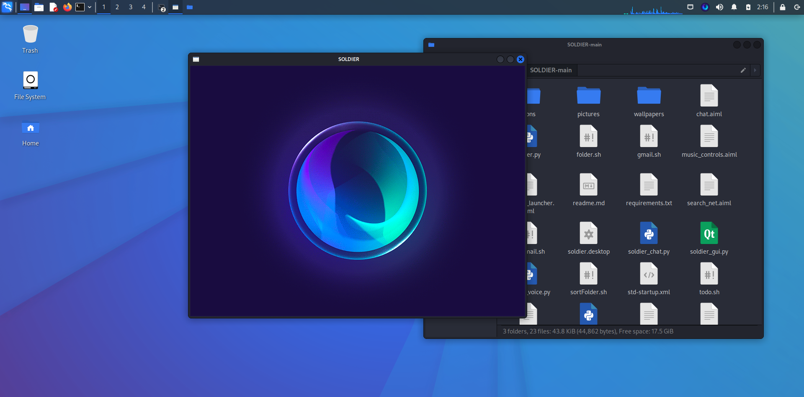

# I have no name!

The idea to build this robot came from the Iron Man movie. Jarvis, an intelligent robot that talks to Iron Man and obeys his orders. Why don't we have these robots? I do not know, so we can build our own robot.
I have no idea to choose a name, so I named my robot "No Name". Or maybe I call him Soldier because It looks cool!
While writing this robot, many ideas came to my mind, but I did not write them all down and I do not remember some of them, so I'll check the project from time to time and add new things.
This robot is currently designed and implemented on my system and in accordance with the programs installed on my system, so to run this robot on your system, you need to know a little bit of Python and Linux to change it to work on your system.
This robot absolutely needs to be programmed to behave the way you like. It can do whatever you like, I personally connected my room lamp to the robot with an Arduino board and a bit of wiring, and I can turn the lamp on and off with my own voice But you can do anything else with this robot and add new features. Just write enough script for what you want to do and add it to the robot's brain.
So if it does something unexpected, do not panic and start reading the source code and look for bugs!!!
Maybe later I will try to write this robot for other operating systems
<br />

<figure>
    
    <figcaption>A screenshot of how it looks like.</figcaption>
</figure>

<!--


## Runing


[Wathch me on youtube](https://www.youtube.com/) 
-->
<br />

## Installation:
I am using ubuntu so you can only use these commands on debian based systems. If you are using another system, find a way to install the following packages in your system and If anything goes wrong, just Google it.<br />
First you should install required python libraries using `pip3 install --upgrade -r requirements.txt`<br />
then install following packages:

```bash
sudo apt install python3-wheel python3-setuptools python3-pip swig
sudo apt install espeak ffmpeg python3-pyqt5 python3-alsaaudio python3-pyaudio python3-pocketsphinx python3-gi
```
<!-- 
Some errors may occur due to C-Python compilers and libraries

sudo apt install libcairo2 libcairo2-dev portaudio19-dev libasound2-dev libespeak1 
-->

## Run:
You can run different scripts for different modes:
|file|description|
|-|-|
|soldier_chat.py|You need to chat with the robot to communicate with it|
|soldier_voice.py|You need to use your voice to talk to it|
|soldier_gui.py|In this case, it has a user interface and It supports both chat and voice, but cannot use both modes at the same time.|
just run one of them an enjoy.
<br />

## DesktopShortcut:
for creating the Soldier's icon in desktop and your application menu, you have to copy [soldier.desktop](soldier.desktop) to `/home/your username/.local/share/applications`. (Don't forget to edit desktop file before copying it!)

## Examples

- ### Converses, barely.

    >**Talk to Me :** hello
    >**Answer :** Well, hello<br />
    >**I am listening :** my boy
    >**Answer :** Welcome home, sir!

- ### Rhythmbox: Play, Stop, Open.

    Uses shell commands to play and pause rhythmbox music.
    (you should have installed rhytmbox on your system!)
    <br />
    >**Talk to Me :** play music
    >**Answer :** On it!<br />
    >**Talk to Me :** Stop music
    >**Answer :** On it!<br />
    >**Talk to Me :** Next Track
    >**Answer :** Right away, sir!<br />
    >**I am listening :** Previous Track
    >**Answer :** Right away, sir!<br />

- ### Tells the time.
    
    >**Talk to Me :** what time is it?
    >**Answer :** The time is 4 43 am<br />

- ### Suggests Googling for all unrecognized interrogative questions

    >**Talk to Me :** What is IOT?
    >**Answer :** Do you want me to google that for you?<br />
    >**Talk to Me :** yes
    >**Answer :** Right away, sir!  Created new window in existing browser session.<br />

    Uses [youtube.py](youtube.py) to find the first search result for the last user input in above case, and opens it in a new tab on firefox.

- ### Searches things on internet.

    >**I am listening :** Google what is the answer to life?
    >**Answer :** Right away, sir!  Created new window in existing browser session.<br />
    >**Talk to Me :** Search youtube for banana
    >**Answer :** On it!  Created new window in existing browser session.<br />
    >**Talk to Me :** Search for gas station on google maps
    >**Answer :** On it!  Created new window in existing browser session.<br />

- ### Changes wallpaper

    Put your wallpapers in folder named wallpapers, so bot will change your desktop background to one of them when you want.
    <br />
    >**I am listening :** change wallpaper
    >**Answer :** On it!<br />
    
- ### Volume control

    >**Talk to Me :** increase valume to *
    >**Answer :** Right away, sir!<br />
    >**I am listening :** decrease valume to *
    >**Answer :** Right away, sir!<br />

- ### Launches Programs
    
    >**I am listening :** open nautilus
    >**Answer :** Right away, sir!<br />
    >**Talk to Me :** take me to /etc
    >**Answer :** Sure thing! (Opens /etc in nautilus)<br />
    >**I am listening :** take me home
    >**Answer :** Sure thing! (Opens ~ in nautilus)<br />
    >**I am listening :** open calculator
    >**Answer :** Sure thing!<br />


- ### Close and exit

    >**I am listening :** exit / quit / bye / goodbye
    >**Answer :** Sure thing, goodbye!<br />

- ### Other
    
    Standard replies for unrecognized/unmatched inputs.

## Notice

> :warning: **Warning:** This repository is just a project for my freetime and it comes with absolute no support and I do not take responsibility for any problems caused by the robot.<br />

> :bulb: **Tip:** I have to tell this again, This robot is not capable of learning and you have to add new and desired sentences to the robot using AIML language. Maybe in the future I will add "how to add new sentences to bot" in the wiki section.

### Todo list

- [ ] add support for other os
- [ ] review scripts and edit them
- [ ] add more AI files from other robots
- [ ] add wiki
- [x] add more pictures for mainwindow
<!-- add option for random mainwindow animation -->
- [ ] maybe an installer?
- [ ] add soldier-assistant to run script and make .desktop file
- [ ] pack the scripts to be neat
- [ ] make a script-handler that aiml files call it to run other programs
<!-- Everything comes together and it becomes easier to edit and more general calls can be made from aiml files to central runner so it'll be easier to support other os-->
